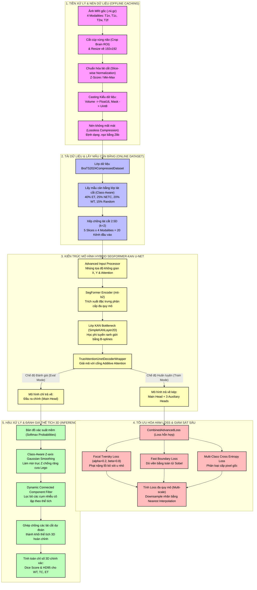

# BÁO CÁO CÔNG NGHỆ VÀ LÝ THUYẾT KIẾN TRÚC MÔ HÌNH (BraTS 2024)
*Tài liệu hướng dẫn bảo vệ luận văn & thuyết trình trước hội đồng*

Báo cáo này liệt kê toàn bộ các công nghệ, thư viện, mô hình toán học và lý thuyết học sâu đang được triển khai trực tiếp trong file Notebook `BraTS2024_UNet_SegFormer.ipynb`.

---

## 🗺️ SƠ ĐỒ PIPELINE TOÀN DIỆN (END-TO-END PIPELINE)

Dưới đây là sơ đồ mô tả toàn bộ luồng hoạt động từ dữ liệu đầu vào, qua xử lý, mô hình hóa cho đến hậu xử lý và đánh giá khối 3D:

---

## 1. KIẾN TRÚC MÔ HÌNH (MODEL ARCHITECTURE)

### 1.1. SegFormer (mit-b2) Encoder
*   **Lý thuyết chuyên sâu:** SegFormer là một kiến trúc Transformer phân cấp chuyên biệt cho phân đoạn ảnh do NVIDIA phát triển. Khác với ViT truyền thống (chia ảnh thành các patch phẳng cố định kích thước lớn và phải sử dụng positional encoding), SegFormer sử dụng bộ mã hóa **Mix Transformer (MiT)**:
    *   **Phân cấp (Hierarchical):** Mô hình sinh ra các bản đồ đặc trưng đa quy mô (multi-scale) từ độ phân giải lớn đến nhỏ: $1/4$, $1/8$, $1/16$, và $1/32$ kích thước gốc. Điều này cực kỳ quan trọng đối với dữ liệu ảnh y tế y khoa, giúp phát hiện cả khối u lớn diện rộng (như phù nề WT) lẫn u nhỏ nằm sâu (như u hoạt hóa ET).
    *   **Không dùng Positional Encoding:** Dùng tích chập 3x3 kết hợp với các lớp Zero-Padding (được gọi là Mix-FFN) xen kẽ để tự động học thông tin vị trí một cách tự nhiên. Thiết kế này giúp mô hình hoạt động cực kỳ ổn định ngay cả khi thay đổi kích thước ảnh đầu vào lúc suy luận.
*   **Mã nguồn:** Mô hình được kế thừa và gọi thông qua thư viện `segmentation-models-pytorch` (smp) kết hợp với backbone pre-trained `mit-b2` của HuggingFace.
*   **Tài liệu tham khảo:**
    *   [Đọc bài báo gốc SegFormer (ArXiv)](https://arxiv.org/abs/2105.15203)
    *   [HuggingFace SegFormer Documentation](https://huggingface.co/docs/transformers/model_doc/segformer)

### 1.2. Kolmogorov-Arnold Networks (KAN) Bottleneck
*   **Lý thuyết chuyên sâu:** KAN là kiến trúc mạng nơ-ron đột phá thay thế Multi-Layer Perceptrons (MLPs) truyền thống dựa trên định lý biểu diễn Kolmogorov-Arnold. Trong khi MLP áp dụng các trọng số tuyến tính cố định ($w$) trên các cạnh nối và hàm kích hoạt phi tuyến tính cố định tại các nút (node) (như ReLU, GeLU), KAN lại đặt **hàm kích hoạt phi tuyến tính học được (thường là các đường cong B-splines hoặc hàm lượng giác)** trực tiếp lên các cạnh nối:
    $$\Phi(x) = \sum_{q=1}^{2n+1} \Phi_{q} \left( \sum_{p=1}^{n} \phi_{q,p}(x_p) \right)$$
    Trong mô hình phân đoạn lai (hybrid) này, tại khối thắt cổ chai (bottleneck) 2D, lớp KAN (`SimpleKANLayer2D`) thay thế cho tích chập 1x1 MLP thông thường. Điều này tăng cường khả năng học và xấp xỉ các biểu diễn phi tuyến tính cực kỳ phức tạp của ranh giới khối u não Glioma.
*   **Mã nguồn:** Triển khai bằng lớp `SimpleKANLayer2D` tự định nghĩa với các tham số học `base_weight` (tuyến tính) kết hợp với mạng xấp xỉ hàm phi tuyến bằng spline học được thông qua phép biến đổi lượng giác (sin/cos).
*   **Tài liệu tham khảo:**
    *   [Đọc bài báo gốc KAN (ArXiv)](https://arxiv.org/abs/2404.14756)
    *   [Efficient-KAN GitHub Repository](https://github.com/Blealtan/efficient-kan)

### 1.3. True Attention Gate (Additive Attention)
*   **Lý thuyết chuyên sâu:** Được lấy cảm hứng từ kiến trúc **Attention U-Net** (Oktay et al.). Ở các đường kết nối tắt (skip-connections), các bản đồ đặc trưng truyền trực tiếp từ Encoder thường chứa nhiều thông tin nhiễu do độ phân giải cao và chưa qua lọc. Cổng chú ý cộng tính (Additive Attention Gate) sử dụng tín hiệu dẫn đường $g$ (lấy từ tầng sâu hơn của Decoder) để lọc thông tin đặc trưng của skip-connection $x$ trước khi đưa vào Decoder. Công thức tính toán:
    $$\alpha = \sigma\left(\psi^T\left(\text{ReLU}(W_x^T x + W_g^T g + b_g)\right) + b_{\psi}\right)$$
    $$x_{\text{attn}} = x \times \alpha$$
    Trong đó:
    *   $W_x, W_g, \psi$ là các phép tích chập 1x1 nhằm chiếu các đặc trưng về cùng một không gian kênh.
    *   $\sigma$ là hàm sigmoid để nén giá trị trọng số chú ý $\alpha \in [0, 1]$.
    *   $x_{\text{attn}}$ là đặc trưng skip-connection đã lọc nhiễu, giúp giải phóng Decoder khỏi việc xử lý các vùng nền lành.
*   **Mã nguồn:** Định nghĩa qua class `TrueAttentionGate` và tích hợp trực tiếp vào quá trình giải mã thông qua lớp bọc `TrueAttentionUnetDecoderWrapper`.
*   **Tài liệu tham khảo:**
    *   [Đọc bài báo gốc Attention U-Net (ArXiv)](https://arxiv.org/abs/1804.03999)

### 1.4. Giám sát sâu (Deep Supervision)
*   **Lý thuyết chuyên sâu:** Nhằm giải quyết hiện tượng suy giảm gradient (gradient vanishing) khi huấn luyện các mạng sâu. Bằng cách đặt các lớp đầu ra phụ (auxiliary heads) tại các tầng giải mã trung gian của decoder ($1/16$, $1/8$, $1/4$ độ phân giải) và tính loss trực tiếp trên chúng, mô hình được cung cấp thêm các dòng gradient bổ trợ mạnh mẽ từ nhiều cấp độ phân giải. Công thức loss tổng hợp khi có Deep Supervision:
    $$L_{\text{total}} = L_{\text{main\_head}} + \sum_{i=0}^{N} w_i L_{\text{aux\_head}_i}$$
*   **Mã nguồn:** 3 đầu ra tích chập phụ `self.aux_head0`, `self.aux_head1`, `self.aux_head2` được bọc bên trong decoder wrapper.
*   **Chi tiết hoạt động:**
    *   Đầu ra phụ chỉ được sinh ra trong chế độ huấn luyện (`self.training == True`). Khi chạy đánh giá (`eval`), mô hình chỉ trả về một nhánh chính duy nhất để tối ưu thời gian suy luận.
    *   Khi tính loss phụ, nhãn Ground Truth được thu nhỏ về đúng kích thước của tầng decoder tương ứng sử dụng kỹ thuật nội suy lân cận gần nhất (Nearest Interpolation) nhằm bảo toàn nhãn lớp nguyên bản.
*   **Tài liệu tham khảo:**
    *   [Đọc bài báo gốc Deeply-Supervised Nets (ArXiv)](https://arxiv.org/abs/1409.5185)

### 1.5. Bộ xử lý đầu vào nâng cao (Advanced Input Processor)
*   **Lý thuyết chuyên sâu:** Để bù đắp việc thiếu hụt thông tin tọa độ không gian vật lý của các cấu trúc giải phẫu não khi thực hiện cắt lát 2.5D, mô hình nhúng thêm hai bản đồ tọa độ lưới $X, Y$ chuẩn hóa trong khoảng $[-1, 1]$ trực tiếp vào kênh đầu vào của ảnh (tăng số kênh đầu vào từ 20 lên 22). Tiếp đó, đi qua khối chú ý kênh (Channel Attention) kiểu Squeeze-and-Excitation (SE-Block) để mô hình tự học cách cân bằng và nhấn mạnh các chuỗi xung/lát cắt quan trọng nhất.
    *   **Công thức Squeeze (Nén toàn cục):** $z_c = F_{sq}(u_c) = \frac{1}{H \times W} \sum_{i=1}^{H} \sum_{j=1}^{W} u_c(i, j)$
    *   **Công thức Excitation (Kích hoạt thích ứng):** $s = F_{ex}(z, W) = \sigma(W_2 \text{ReLU}(W_1 z))$
*   **Tài liệu tham khảo:**
    *   [Squeeze-and-Excitation Networks (ArXiv)](https://arxiv.org/abs/1709.01507)

---

## 2. TIỀN XỬ LÝ & DỮ LIỆU (PREPROCESSING & DATA)

### 2.1. Đầu vào 2.5D (Stacked Slice Representation)
*   **Lý thuyết:** Phân đoạn 3D MRI toàn vẹn rất tốn tài nguyên GPU (thường gây lỗi Out-Of-Memory). Giải pháp 2.5D kết hợp ưu điểm của cả 2D và 3D:
    *   Mỗi điểm ảnh đích (lát cắt trung tâm $z$) sẽ nhận thêm ngữ cảnh từ các lát cắt lân cận dọc trục Z ($z-2, z-1, z, z+1, z+2$). 
    *   Với 4 chuỗi MRI gốc (T1n, T1c, T2w, T2f), số kênh đầu vào sẽ là $4 \times 5 = 20$ kênh. Mô hình 2D thông thường có thể xử lý đầu vào 20 kênh này để phân đoạn lát cắt trung tâm mà vẫn nắm bắt được thông tin ngữ cảnh 3D dọc trục Z.
*   **Tài liệu tham khảo:**
    *   [Medical Image Segmentation 2D vs 2.5D vs 3D](https://link.springer.com/chapter/10.1007/978-3-030-59710-8_25)

### 2.2. Lấy mẫu cân bằng lớp (Class-Aware Slice-level Balancing)
*   **Lý thuyết:** Giải quyết bài toán mất cân bằng lớp trầm trọng của tập dữ liệu BraTS Glioma (nơi đa số lát cắt là nền lành hoặc chỉ có phù nề).
*   **Mã nguồn:** Triển khai trực tiếp trong hàm `__getitem__` của Dataset, phân phối xác suất lấy mẫu: 40% ưu tiên lát cắt chứa u hoạt hóa (ET), 25% chứa lõi hoại tử (NETC), 20% chứa u bất kỳ, và 15% ngẫu nhiên.
*   **Cơ chế toán học:** Việc tăng cường tỷ lệ xuất hiện của các nhãn u thiểu số (như ET và NETC) giúp mô hình liên tục được huấn luyện các ca bệnh khó, tối ưu điểm phân đoạn lõi u và u hoạt hóa hiệu quả.

### 2.3. Tăng cường dữ liệu (Data Augmentation)
*   **Thư viện:** `albumentations` - thư viện tăng cường ảnh tốc độ cao viết bằng C++.
*   **Kỹ thuật dùng:** `ElasticTransform` (biến dạng đàn hồi để mô phỏng sự biến dạng vật lý của mô não), `GridDistortion` (méo dạng lưới), và các phép xoay, lật.
*   **Tài liệu tham khảo:**
    *   [Albumentations Documentation](https://albumentations.ai/)

### 2.4. Lưu trữ đệm nén tốc độ cao và tối ưu kiểu dữ liệu (.npz)
*   **Lý thuyết:** Do Kaggle/Google Colab có tốc độ đọc ổ đĩa (Disk I/O) rất chậm, việc giải nén trực tiếp file gốc `.nii.gz` nặng 30MB-50MB ở mỗi epoch là nguyên nhân gây nghẽn cổ chai.
*   **Giải pháp:** Áp dụng thuật toán nén bảo toàn không mất mát (Lossless Compression) **zlib** qua hàm `np.savez_compressed` để lưu trữ dữ liệu đã crop ROI thành file `.npz` nhẹ chỉ ~3MB.
*   **Ép kiểu dữ liệu an toàn:**
    *   Ảnh MRI được lưu dưới dạng `Float16` (bán độ chính xác) giúp giữ nguyên tín hiệu đặc trưng của ảnh đã chuẩn hóa mà tiết kiệm một nửa dung lượng RAM/VRAM.
    *   Nhãn phân đoạn được ép về `Uint8` do chỉ có 5 nhãn lớp ($0, 1, 2, 3, 4$).
*   **Tài liệu tham khảo:**
    *   [NumPy np.savez_compressed](https://numpy.org/doc/stable/reference/generated/numpy.savez_compressed.html)

---

## 3. HÀM MẤT MÁT HỖN HỢP (LOSS FUNCTIONS)

Công thức loss tổng hợp: 
$$L_{\text{total}} = 0.6 \times L_{\text{FocalTversky}} + 0.2 \times L_{\text{CrossEntropy}} + 0.2 \times L_{\text{Boundary}}$$

### 3.1. Focal Tversky Loss (FTL)
*   **Lý thuyết chuyên sâu:** Là hàm loss mở rộng của Dice Loss chuyên biệt cho phân đoạn y tế mất cân bằng nghiêm trọng. Chỉ số Tversky được định nghĩa:
    $$TI_c = \frac{TP_c + \epsilon}{TP_c + \alpha FP_c + \beta FN_c + \epsilon}$$
    *   Với cấu hình $\alpha=0.2$ và $\beta=0.8$, mô hình sẽ phạt cực nặng cho lỗi **bỏ sót khối u (False Negatives)** để tránh việc mô hình bỏ sót u hoạt hóa ET.
    *   Cơ chế **Focal** nâng mức phạt lên lũy thừa $\gamma=0.75$:
        $$FTL_c = (1 - TI_c)^{1/\gamma}$$
        Giúp mô hình tập trung tối ưu năng lượng vào các vùng pixel khó phân loại (ranh giới khối u).
*   **Tài liệu tham khảo:**
    *   [Đọc bài báo gốc Focal Tversky Loss (ArXiv)](https://arxiv.org/abs/1810.07842)

### 3.2. Fast Boundary Loss (Dò biên Sobel)
*   **Lý thuyết chuyên sâu:** Tối ưu hóa trực tiếp hình dạng ranh giới khối u. Sử dụng tích chập với toán tử **Sobel** $G_x$ và $G_y$:
    $$G_x = \begin{bmatrix} -1 & 0 & 1 \\ -2 & 0 & 2 \\ -1 & 0 & 1 \end{bmatrix}, \quad G_y = \begin{bmatrix} -1 & -2 & -1 \\ 0 & 0 & 0 \\ 1 & 2 & 1 \end{bmatrix}$$
    Để trích xuất bản đồ biên (edges) của cả ảnh dự đoán $P$ và nhãn gốc $Y$:
    $$\text{Edge}(I) = \sqrt{(I * G_x)^2 + (I * G_y)^2}$$
    Sau đó, tối ưu khoảng cách sai lệch biên bằng hàm MSE (Mean Squared Error) giữa hai bản đồ biên này, giúp đường viền u sắc nét, không bị răng cưa.
*   **Tài liệu tham khảo:**
    *   [Wikipedia: Sobel Operator](https://en.wikipedia.org/wiki/Sobel_operator)

### 3.3. Multi-Class Cross Entropy Loss
*   **Lý thuyết chuyên sâu:** Hàm mất mát phân loại chéo đa lớp chuẩn mực để tối ưu hóa xác suất của từng điểm ảnh:
    $$L_{CE} = -\frac{1}{N} \sum_{i=1}^{N} \sum_{c=1}^{C} y_{i,c} \log(p_{i,c})$$
    Trong đó $y_{i,c}$ là nhãn nhị phân chỉ ra pixel thứ $i$ có thuộc lớp $c$ hay không, và $p_{i,c}$ là xác suất dự đoán của mô hình qua lớp Softmax.
*   **Tài liệu tham khảo:**
    *   [PyTorch CrossEntropyLoss Documentation](https://pytorch.org/docs/stable/generated/torch.nn.CrossEntropyLoss.html)

---

## 4. HẬU XỬ LÝ & ĐÁNH GIÁ (POST-PROCESSING & EVALUATION)

### 4.1. Bộ lọc làm mịn mượt trục Z (Class-Aware Z-axis Gaussian Smoothing)
*   **Lý thuyết:** Phân đoạn 2.5D lát cắt độc lập thường gây hiện tượng đứt gãy biên không liên tục dọc trục Z khi ghép lại thành khối 3D (hiệu ứng răng cưa Lego).
*   **Giải pháp:** Áp dụng bộ lọc Gaussian 1D dọc trục Z trên bản đồ xác suất mềm (Softmax probabilities) của từng class trước khi lấy hàm argmax. Hàm nhân Gaussian:
    $$G(z) = \frac{1}{\sqrt{2\pi}\sigma} \exp\left(-\frac{z^2}{2\sigma^2}\right)$$
*   **Cấu hình độ lệch chuẩn $\sigma$ tối ưu riêng:**
    *   $\sigma=1.5$ đối với vùng phù nề lớn (SNFH - nhãn 2) để xử lý triệt để răng cưa thô.
    *   $\sigma=0.8$ đối với các vùng u nhỏ (ET - nhãn 3, NETC - nhãn 1) để bảo toàn cấu trúc ranh giới chi tiết.
*   **Thư viện:** `scipy.ndimage.gaussian_filter`.
*   **Tài liệu tham khảo:**
    *   [SciPy gaussian_filter Documentation](https://docs.scipy.org/doc/scipy/reference/generated/scipy.ndimage.gaussian_filter.html)

### 4.2. Bộ lọc thể tích động (Dynamic Connected Component Filter)
*   **Lý thuyết:** Dùng giải thuật gán nhãn thành phần liên thông (Connected Component Labeling) để tìm các cụm pixel u bị cô lập, sau đó xóa bỏ các cụm có thể tích nhỏ hơn ngưỡng tối thiểu riêng biệt của từng class (ví dụ u ET cực nhỏ ngưỡng là 10, phù nề SNFH to ngưỡng là 400).
*   **Thư viện:** `scipy.ndimage.label`.
*   **Tài liệu tham khảo:**
    *   [SciPy Labeling Documentation](https://docs.scipy.org/doc/scipy/reference/generated/scipy.ndimage.label.html)

### 4.3. Chỉ số đánh giá tiêu chuẩn BraTS (BraTS Metrics)
*   **Định nghĩa:** Đánh giá trên 3 vùng gộp lâm sàng:
    *   **Whole Tumor (WT - U toàn bộ):** Nhãn $1 + 2 + 3$.
    *   **Tumor Core (TC - Lõi u):** Nhãn $1 + 3$.
    *   **Enhancing Tumor (ET - U hoạt hóa):** Nhãn $3$.
*   **Chỉ số:**
    *   **Dice Score:** Đo tỉ lệ trùng khớp diện tích.
    *   **HD95 (Hausdorff Distance 95%):** Khoảng cách lớn nhất giữa hai tập điểm biên (lấy phân vị 95% để loại bỏ điểm nhiễu ngoại lai).
*   **Tài liệu tham khảo:**
    *   [Wikipedia: Hausdorff Distance](https://en.wikipedia.org/wiki/Hausdorff_distance)
    *   [BraTS 2024 Challenge Rules](https://www.synapse.org/#!Synapse:syn53708249/wiki/626210)

---

## 5. TỐI ƯU HÓA QUÁ TRÌNH HUẤN LUYỆN (TRAINING OPTIMIZATION)

### 5.1. Thuật toán tối ưu AdamW (Decoupled Weight Decay)
*   **Lý thuyết chuyên sâu:** Trong bộ tối ưu Adam truyền thống, sự phân rã trọng số (weight decay) được áp dụng trực tiếp vào gradient trước khi cập nhật bước chạy. Điều này dẫn đến sự tương tác không mong muốn giữa L2 regularization và các mô-men động lượng lịch sử (momentum), làm mất đi tính đúng đắn của L2 regularization. 
    *   **AdamW** khắc phục điều này bằng cách tách biệt (decouple) sự phân rã trọng số ra khỏi bước cập nhật gradient:
        $$\theta_{t+1} = \theta_t - \eta_t \left( \frac{\hat{m}_t}{\sqrt{\hat{v}_t} + \epsilon} + \lambda \theta_t \right)$$
        Trong đó $\lambda$ là hệ số weight decay, $\theta$ là trọng số mô hình. Điều này cực kỳ quan trọng đối với các kiến trúc Transformer (như SegFormer) giúp chống overfitting hiệu quả và hội tụ ổn định hơn.
*   **Tài liệu tham khảo:**
    *   [Decoupled Weight Decay Regularization (ArXiv)](https://arxiv.org/abs/1711.05101)

### 5.2. Bộ lập lịch học tập Cosine Annealing Learning Rate
*   **Lý thuyết chuyên sâu:** Học phí (learning rate) được giảm dần theo hàm Cosine từ giá trị lớn nhất $\eta_{max}$ xuống $\eta_{min}$:
    $$\eta_t = \eta_{min} + \frac{1}{2}(\eta_{max} - \eta_{min})\left(1 + \cos\left(\frac{T_{cur}}{T_{max}}\pi\right)\right)$$
    Việc điều chỉnh Learning Rate dạng hình sóng Cosine giúp mô hình vượt qua các điểm yên ngựa (saddle points) dễ dàng hơn ở pha đầu và hội tụ cực sâu vào các thung lũng phẳng tối ưu (flat minima) ở pha cuối.
*   **Tài liệu tham khảo:**
    *   [SGDR: Stochastic Gradient Descent with Warm Restarts (ArXiv)](https://arxiv.org/abs/1608.03983)

### 5.3. Huấn luyện chính xác hỗn hợp tự động (Automatic Mixed Precision - AMP)
*   **Lý thuyết chuyên sâu:** Quá trình huấn luyện sử dụng đồng thời kiểu dữ liệu `Float16` (để tính toán lan truyền xuôi và ngược nhanh trên GPU) và `Float32` (để lưu trữ trọng số gốc và tính loss nhằm bảo toàn độ chính xác số học).
    *   **GradScaler:** Sử dụng bộ điều chỉnh thang đo gradient để nhân các loss với một hệ số tỉ lệ $S$ trước khi lan truyền ngược nhằm tránh hiện tượng triệt tiêu số học của các gradient nhỏ (Underflow) khi biểu diễn ở dạng `Float16`. Trước khi cập nhật trọng số, bộ chia thang đo sẽ chia ngược lại cho $S$.
*   **Tài liệu tham khảo:**
    *   [PyTorch Automatic Mixed Precision Package](https://pytorch.org/docs/stable/amp.html)
